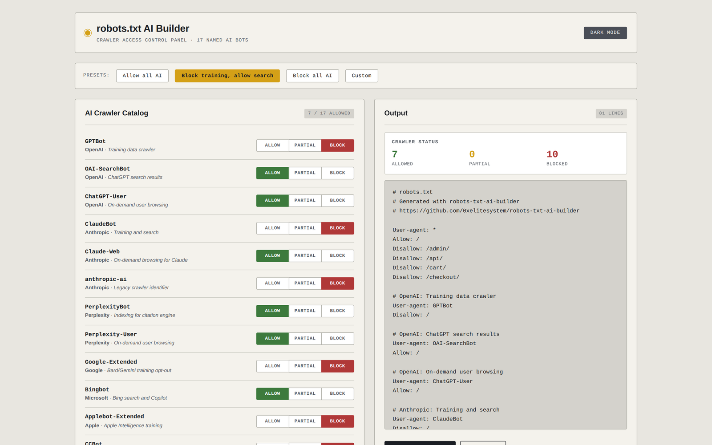

# robots-txt-ai-builder

Build a `robots.txt` with named AI crawler allow/block rules for 17 cataloged bots. Browser-only, no signup.

**Live demo:** https://0xelitesystem.github.io/robots-txt-ai-builder/



## What it does

Toggle Allow, Partial, or Block per AI crawler. Set sitemap URL, llms.txt URL, and global disallow paths. Generated robots.txt updates live.

## 17 AI bots cataloged

| Bot | Vendor | Purpose |
|---|---|---|
| GPTBot | OpenAI | Training data crawler |
| OAI-SearchBot | OpenAI | ChatGPT search results |
| ChatGPT-User | OpenAI | On-demand user browsing |
| ClaudeBot | Anthropic | Training and search |
| Claude-Web | Anthropic | On-demand Claude browsing |
| anthropic-ai | Anthropic | Legacy crawler identifier |
| PerplexityBot | Perplexity | Indexing for citation engine |
| Perplexity-User | Perplexity | On-demand user browsing |
| Google-Extended | Google | Bard/Gemini training opt-out |
| Bingbot | Microsoft | Bing search and Copilot |
| Applebot-Extended | Apple | Apple Intelligence training |
| CCBot | Common Crawl | Open dataset feeding many LLMs |
| Meta-ExternalAgent | Meta | Meta AI training |
| Bytespider | ByteDance | TikTok/Doubao training |
| Amazonbot | Amazon | Alexa and Amazon AI |
| FacebookBot | Meta | Facebook AI assistants |
| DuckAssistBot | DuckDuckGo | DuckAssist assistant |

## Presets

- **Allow all AI**: every cataloged bot can crawl. Use when you want maximum AI visibility.
- **Block training, allow search**: blocks bots whose primary purpose is LLM training (GPTBot, ClaudeBot, CCBot, etc), keeps search bots that drive traffic. Most common middle-ground choice.
- **Block all AI**: blocks every cataloged AI bot. Use for paywalled or proprietary content.
- **Custom**: pick per-bot.

## Use

Open `index.html` in any browser. Or visit `https://0xelitesystem.github.io/robots-txt-ai-builder/`.

1. Pick a preset or toggle bots individually.
2. Enter your sitemap URL and (optional) llms.txt URL.
3. Add any global disallow paths (admin, cart, checkout, etc).
4. Copy or download the robots.txt.
5. Upload to your web root so it serves at `https://yoursite.com/robots.txt`.

## Why this exists

Deciding which AI crawlers may read your site means knowing each bot's user-agent name and writing a block for it. This builder lists the bots and writes the rules from a set of toggles. It is one HTML file with no tracking and no network calls. MIT licensed.

## What "Partial" means

Allows the bot but applies your disallow paths to it specifically. Useful when you want a bot to index your public content but skip private sections.

## What's NOT included

- No localStorage. Refresh clears your settings.
- No backend, no analytics, no third-party scripts.
- No bot signature verification (use HTTP logs or fail2ban for that).

## Important notes

- robots.txt is a request, not enforcement. Well-behaved bots respect it; misbehaved bots ignore it. For hard blocks, use server-level rules.
- The bot user-agent strings here are current as of build date. Vendors occasionally change them; check vendor docs if a bot starts ignoring your rules.
- "Disallow: /" blocks the bot from your entire site. Test with a small section first if you are uncertain.

## Pairs with

- [llms-txt-generator](https://github.com/0xelitesystem/llms-txt-generator): create the llms.txt this robots.txt can advertise
- [schema-markup-generator](https://github.com/0xelitesystem/schema-markup-generator): structured data layer that AI engines read
- [geo-audit-checklist](https://github.com/0xelitesystem/geo-audit-checklist): the full checklist this tool sits inside

## Privacy

Everything runs in your browser. No network requests, no analytics, no third-party scripts. The toggles, URLs and paths you enter are not saved, so a refresh clears them. If you click the theme toggle, your light or dark choice is saved in your browser's localStorage under the key `theme`. Nothing else is stored.

## Run locally

```bash
git clone https://github.com/0xelitesystem/robots-txt-ai-builder
cd robots-txt-ai-builder
```

Open `index.html` in any browser. Or serve the folder with `python -m http.server 8000` and visit http://localhost:8000/.

## Build

No build step. The whole tool is one `index.html` file with its CSS and JavaScript inline.

## More

Part of a catalog of single-file browser tools and plain-language references, all MIT licensed and dependency-free: [0xelitesystem.github.io](https://0xelitesystem.github.io/). Built by [elitesystem.ai](https://elitesystem.ai).

## License

MIT. Free to use, fork, modify, and ship.
